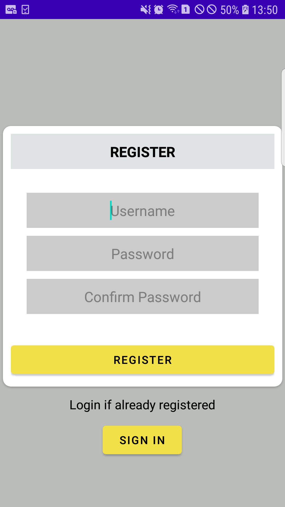

# Android Final App

**This readme file consists of the tasks covered for the final TODO app of Mobile Application Development module. The task provided 
in this component was to create a simple todo application comprising several topics that were covered in this module. Hence, all 
the requirements were fulfilled and a fully functioning TODO app was developed. The functions accumulated in the app are presented
with appropriate screenshots and screen recordings.**

---

## Registration Process

**For the sign up process, a registration form needs to be filled. Users must provide a username and password for signing up and 
the form also has validations for empty input fields, duplicate username and dissimilar passwords. There is also an option to login
directly from the registration page using the 'sign in' button located below the form.**

### The Registration UI

**The screenshot below shows the user interface for the sign up page.**

### Form Validation

**The screen recordings below show the validation process involved in the form.**

*For empty input fields*

*For duplicate username*

*For incorrect credentials*

### Registering New User

**The screen recording presented below shows the successful process of registering a new user into the system. After a user
is registered successfully, s/he can redirect to the login form page where they can use the same login details they provided.**

---

## Login Process

**The login process comes after the registration process and the user will have to use the credentials that they used while
signing up to the system. The form also has validation for the incorrect input details and empty fields. After successful login,
the users will be taken to the main page where they have features like adding a to do task, updating their profile detail, 
deleting the to do and logging out of the system.**

### The UI for Login

**The screenshot below shows the UI for the login page.**

### Form Validation

**The screen recording below shows the validation feature assigned in the login form.**

### Logging In

**The screen recording below shows the user logging in the app. After being logged in, the user can add a to do by using the 
floating circular button present at the bottom-right corner of the page.**

---

## Adding a New Todo

**After logging into the app, a user will be able to create a to do or even a list of to dos. They can use the floating
circular button to do so. When the button is pressed, a form will pop up tht has several input fields for the to do details. The
form has fields like the title of to do, the description, completion date and the priority of the todo. The date field will
display a date dialog box for selecting the date and there is also a checkbox that can be used for marking the todo as completed
before creating it. After filling the details, the users can hit the save button and they will be redirected to the user home activity.**

### The Add Todo Form

**The screenshot below shows the form for adding a new to do.**

### Adding Todo

**The screen recording below shows the process of creating a new to do by filling all the to do details.**

---

## Updating a Todo

**The to do that was added can also be updated by double clicking the to do itself. Doing so will display the to do form that
can be used to update the information again. After updating, the user will be taken back to the home activity.**

### Updating the Todo

**The screen recording below shows the process of a to do being updated by re-filling the to do form.**

---

## Deleting a Todo

**There are two different ways to delete a to do in the app. The first method is to swipe left or right on the todo and the 
second method is to use the menu found in the toolbar. The menu also has two delete processes; one is to delete the to do that
are completed or checked and another is to delete all the to do at once.**

### Deleting the Todo by Swiping

**The screen recording below shows the swiping method to delete a to do.**

### Deleting the Todo Using the toolbar Menu

**The screen recordings below shows the to do being deleted using the menu from the toolbar.**

*Deleting the checked to dos*

**The screen recording below shows the checked to dos being deleted.**

*Deleting all to dos at once*

**The screen recording below shows all the to dos being deleted.**

---

## User Password Update

**The app also consists of the feature to update the user profile, specially the password. The user can use the toolbar to 
navigate to the user profile page by clicking on their username. By doing so, the user profile page will be displayed where they
have to provide their old and new password. There is also input validation for the old password field where an error message is
shown for incorrect old password.**

### User Profile UI

**The screenshot below shows the user profile page.**

### Updating the Password 

**The screen recording below shows the profile update process being conducted.**

### Old password validation

**The screen recording below shows the old password field being validated.**

---

## Deleting an Account

**The users also have the privilege to delete their account permanently from the system. It can be done by navigating to the 
user profile page where they can access the 'Delete Account' button at the bottom of the page. If the button is clicked, an 
alert dialog box will e displayed that will ask for the delete confirmation.**

### Alert Dialog box

**The screenshot below shows the alert dialog box after the 'Delete Account' button is pressed.**

### Deleting the User Account

**The screen recording below shows the process of deleting the user account permanently from the system.**

---

## Logging Out 

**In the same way, for logging out of the app, the users can use the toolbar menu option. Pressing the menu option will display
a dropdown menu that has the 'logout' option. The users can log out by clicking the option and they will be redirected back to
the login page.**

**The screen recording below shows the log out process in the app.**

---

## Landscape View for the App

**The screen recordings below show the features of app being executed in landscape mode.**
